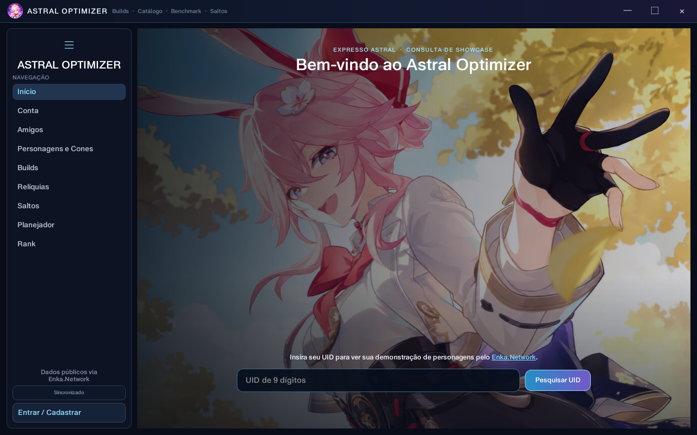
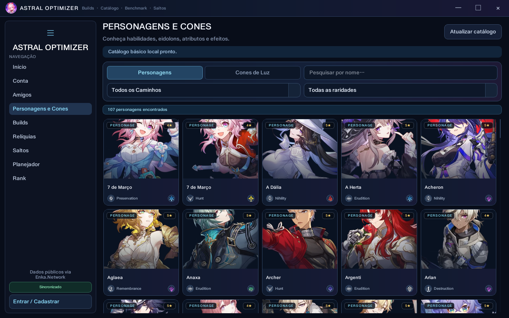
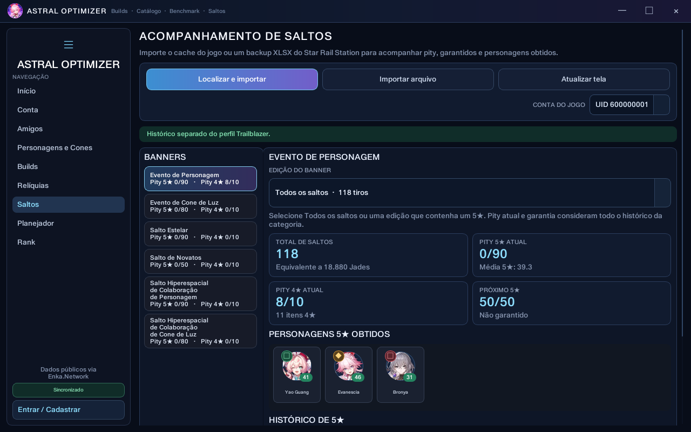

<div align="center">

  # Astral Optimizer

  **Builds, relíquias, benchmark, catálogo e Saltos de Honkai: Star Rail em um único aplicativo para Windows.**

  [](https://github.com/CesarTOnishi/Astral-Optimizer/releases)
  [](https://github.com/CesarTOnishi/Astral-Optimizer/releases)
  [](https://www.python.org/)
  [](https://doc.qt.io/qtforpython-6/)

  [Baixar a versão mais recente](https://github.com/CesarTOnishi/Astral-Optimizer/releases/latest) · [Reportar um problema](https://github.com/CesarTOnishi/Astral-Optimizer/issues) · [Créditos](THIRD_PARTY_NOTICES.md)
</div>



## Sobre

O **Astral Optimizer** é um aplicativo desktop local para consultar contas públicas de Honkai: Star Rail pelo UID, analisar equipamentos, comparar builds e acompanhar recursos da conta. Ele reúne dados do [Enka.Network](https://enka.network/), cálculos adaptados do [Fribbels HSR Optimizer](https://github.com/fribbels/hsr-optimizer) e informações do [StarRailRes](https://github.com/Mar-7th/StarRailRes) em uma interface inspirada no jogo.

O aplicativo não solicita acesso à conta HoYoverse. As consultas utilizam apenas o Showcase público configurado dentro do jogo. Perfis, históricos e configurações permanecem no computador do usuário.

## Novidades da versão 1.2.0

> **Correção 1.2.1:** o instalador automático agora registra o resultado, tenta novamente quando arquivos estão bloqueados, valida o executável copiado e reabre o aplicativo. Avisos orientam o usuário a aguardar a reabertura automática. O empacotamento também impede publicar um executável compilado com a versão errada.

- sincronização da conta durante a tela de carregamento ao abrir o aplicativo;
- dashboard da UID principal com avatar do jogo, personagens, benchmarks, Saltos e relíquias;
- central de notificações para atualização do aplicativo e catálogo, backup, mudanças de relíquias e soft pity;
- modo de privacidade que oculta a UID das imagens compartilhadas;
- análises de Saltos com gráficos por mês e versão, média de pity, histórico de 50/50 e detecção de lacunas;
- exportação do histórico de Saltos para CSV/JSON e cartão PNG compartilhável com todos os resultados 5★, pity, garantia e estatísticas;
- planejamento sequencial com estratégias de S1 ou Eidolons, chances e estimativas otimista, média e pessimista;
- seis temas globais aplicados imediatamente e opção para reduzir animações;
- configurações reorganizadas em Perfil, Aparência, Privacidade, Backup e Aplicativo;
- tutorial guiado de 20 etapas com balões apontando para os controles reais;
- atalhos de teclado, estados vazios explicativos, diagnóstico técnico e botões para copiar detalhes de erros;
- seletor de edições de banner, histórico visual somente de 5★ e identificação persistente das edições.

## Principais recursos

| Recurso | Funcionalidades |
| --- | --- |
| Consulta por UID | Perfil público, personagens, nível, Eidolons, Cones, relíquias e atributos |
| DPS Benchmark | Pontuação, classificação, atributos em combate e dano por habilidade com o motor Fribbels |
| Times | Time padrão e composição customizada com Eidolons, Cones e sobreposições |
| Histórico de builds | Até cinco versões por personagem, comparação, exclusão e registro do time utilizado |
| Exportação | Cartão PNG da build para compartilhar no Discord e em outras redes |
| Relíquias | Inventário persistente, pontuação, filtros e histórico de portadores |
| Saltos | Cache/XLSX, pity, garantido, 50/50, 75/25, edições, gráficos e exportação CSV/JSON |
| Planejador | Recursos, pity, garantia, estratégias sequenciais e simulação probabilística entre E0 e E6S5 |
| Catálogo | Personagens, Cones, habilidades, Rastros, Eidolons e efeitos S1–S5 |
| Conta e amigos | Dashboard da UID principal, personagens com benchmark, lista de amigos e acesso às builds |
| Experiência | Temas, tutorial guiado, atalhos, diagnóstico, acessibilidade e estados vazios |
| Privacidade | Opção para ocultar a UID dos cartões PNG compartilhados |
| Notificações | Alertas de catálogo, versão, backup, relíquias e proximidade do soft pity |
| OneDrive | Backups versionados do histórico de Saltos e planejador em pasta sincronizada |
| Atualizador | Verificação de novas Releases e atualização pelo GitHub |

## Galeria

### Tela inicial e pesquisa por UID

Pesquise qualquer UID válido sem substituir a conta principal salva no perfil local.


### Catálogo de personagens e Cones de Luz

Pesquise personagens e Cones, filtre por Caminho ou raridade e abra informações detalhadas.



### Acompanhamento de Saltos

Visualize pity, garantia, resultados 5★ e tiros gastos em cada edição de banner.



## Análise de builds

Ao pesquisar uma UID, o Astral carrega os personagens publicados no Showcase e apresenta:

- arte, elemento, Caminho, nível e Eidolon;
- Cone de Luz equipado, nível e sobreposição;
- seis relíquias com atributos, melhorias e pontuação;
- atributos básicos e atributos em combate adequados ao arquétipo;
- DPS Benchmark e classificação calculados com o motor Fribbels;
- time padrão ou composição customizada;
- comparação de melhorias de subatributos e atributos principais;
- detalhamento estimado do dano das habilidades da rotação.

Personagens de CRIT, DoT, Quebra, suporte e arquétipos híbridos exibem os atributos relevantes para sua função. Quando o motor ainda não oferece cálculo para um personagem, a interface informa a indisponibilidade sem interromper a página.

## Times padrão e customizados

- **Padrão:** composição utilizada como referência pelo motor Fribbels.
- **Customizado:** seleção manual dos companheiros e configurações.

No modo customizado é possível pesquisar personagens, definir Eidolons, escolher Cones de Luz e sobreposições e configurar relíquias e ornamentos. As mudanças recalculam os atributos em combate e o benchmark quando houver suporte no motor.

## Histórico e exportação de builds

Cada perfil pode guardar até cinco versões de uma build para o mesmo personagem e UID. O snapshot registra equipamentos, atributos, benchmark e o modo do time.

Na comparação, ganhos aparecem em verde, perdas em vermelho e valores sem alteração em cinza. Qualquer snapshot pode ser excluído. O botão **Exportar PNG** gera um cartão 1200×675 com personagem, Cone, equipe, atributos, relíquias e DPS Benchmark.

## Inventário de relíquias

A aba **Relíquias** mantém todas as peças encontradas nos personagens publicados da UID principal. Trocar equipamentos ou publicar outro personagem não apaga peças vistas anteriormente.

O inventário oferece:

- ordenação da melhor para a pior pontuação;
- filtros separados de relíquias e ornamentos;
- filtros por personagem, conjunto, parte e situação;
- indicação do portador atual;
- registro do personagem que utilizava anteriormente a peça;
- atualização ao consultar novamente a conta.

## Catálogo

A aba **Personagens e Cones** funciona sem UID. Ela utiliza dados e imagens locais como fallback e pode sincronizar detalhes em português do StarRailRes.

**Personagens:** atributos no nível 80, elemento, Caminho, Kit principal, Rastros e Eidolons.

**Cones de Luz:** arte completa, Caminho, atributos no nível 80, efeito passivo, alternância S1–S5 e destaque dos valores alterados pela sobreposição.

Os dados sincronizados ficam em `%LOCALAPPDATA%\AstralOptimizer\catalog`. A atualização utiliza uma pasta temporária para impedir que downloads incompletos substituam a última versão válida.

## Acompanhamento de Saltos

A aba **Saltos** aceita:

- arquivo `data_*` do cache local do jogo;
- backup `.xlsx` exportado pelo Star Rail Station, limitado a 5 MB.

Categorias reconhecidas:

- Evento de Personagem;
- Evento de Cone de Luz;
- Salto Estelar;
- Salto de Novatos;
- Salto Hiperespacial de Colaboração de Personagem;
- Salto Hiperespacial de Colaboração de Cone de Luz.

O acompanhamento mostra total de tiros, equivalência em Jades, pity de 5★ e 4★, garantia, média de obtenção e resultados ganho/perdido/garantido. Use **Importar do jogo** para localizar automaticamente o cache instalado ou **Importar XLSX ou cache** para escolher um arquivo manualmente. As cores verde, laranja e vermelha identificam a faixa do pity.

No primeiro uso de **Importar do jogo**, uma introdução explica por que é necessário abrir o Histórico de Saltos e reproduz um vídeo curto com o procedimento. Depois que a lista carregar dentro do jogo, feche completamente o Honkai: Star Rail para liberar o arquivo de cache e somente então faça a importação no Astral. O tutorial possui apenas o botão **Fechar** e não inicia a importação sozinho. O antigo botão **Atualizar tela** foi removido porque a interface já é atualizada automaticamente após cada importação.

Se o cache continuar ausente ou não contiver um link válido, o próprio aviso apresenta **Ver tutorial novamente**.

Se a instalação não for localizada, abra **Configurações → Aplicativo → Pasta webCaches** e selecione a pasta `webCaches` do jogo. O Astral escolhe numericamente a subpasta de maior versão e segue automaticamente por `Cache\Cache_Data\data_2`. Abra o Histórico de Saltos para gravar o link temporário, espere a lista carregar e feche completamente o jogo antes de usar **Importar do jogo**.

A área de análises inclui gráficos de tiros por mês e por versão ou edição, comparação da média pessoal de pity com a média teórica, histórico de resultados no 50/50 ou 75/25 e identificação de possíveis lacunas ou registros incompletos. O histórico pode ser exportado em CSV ou JSON. O botão **Exportar cartão** cria uma imagem com todos os resultados 5★ do filtro, pity atual, garantia, totais, média, mediana, melhor e pior pity, distribuição por faixa, vitórias, derrotas, taxa de vitória e gráfico mensal. Cada resultado usa verde, laranja ou vermelho conforme o pity obtido, e a imagem cresce verticalmente para não omitir resultados. A UID é ocultada automaticamente quando o modo Privacidade está ativo.

O dropdown possui **Todos os saltos** e as edições individuais que contenham um resultado 5★. O total e o pity consideram todos os tiros, enquanto a vitrine e o histórico mostram somente personagens ou Cones 5★. Isso evita usar itens 3★ como capa de banners sem resultados relevantes.

Dados antigos podem receber o identificador da edição ao reimportar o XLSX, sem duplicar registros. Se um backup de colaboração possuir apenas resumos, o Astral preserva seus totais e pities, mas não cria tiros individuais inexistentes.

## Planejador de tiros

O Planejador lê automaticamente pity e garantia dos banners limitados e combina esses dados com:

- Jades Estelares;
- Passes Especiais;
- Luz Estelar;
- cashback estimado de 0%, 4%, 7,5% ou 11%;
- estratégia de aquisição começando por S1 ou por um Eidolon entre E0 e E6.

As metas são montadas automaticamente na ordem da estratégia escolhida, sem campo de texto manual. A tabela calcula a chance disponível em cada etapa e apresenta cenários otimista, médio e pessimista usando as distribuições de soft pity e taxas adotadas pelo Fribbels.

## Dashboard da conta

Ao entrar em um perfil e configurar a UID principal, a página **Conta** reúne avatar escolhido no jogo, nível, Equilíbrio, conquistas, personagens públicos com benchmark, totais e pity dos Saltos, últimos resultados 5★ e as relíquias mais bem pontuadas. A sincronização começa durante a tela de carregamento e pode ser repetida pelo botão **Atualizar conta**.

Clicar no perfil da barra lateral também abre esse dashboard. A página mantém os dados separados por perfil local e UID, sem misturar históricos de contas diferentes.

## Experiência, temas e acessibilidade

As Configurações são divididas em **Perfil**, **Aparência**, **Privacidade**, **Backup** e **Aplicativo**. Os temas Astral, Obsidiana, Aurora, Jade Estelar, Carmesim e Alto contraste são aplicados imediatamente em toda a interface.

Em **Aplicativo**, também é possível selecionar manualmente a pasta `webCaches` usada pela importação de Saltos ou restaurar a localização automática.

A opção **Reduzir animações** diminui transições em computadores mais fracos. Na primeira abertura, um tutorial de 20 etapas escurece a interface, destaca os controles reais e explica as principais funções. Ele pode ser revisto pelas Configurações ou com `F1`.

Atalhos disponíveis:

- `Ctrl+1` a `Ctrl+7`: navegar pelas principais abas;
- `Ctrl+K`: pesquisar uma UID;
- `Ctrl+B`: recolher ou expandir a barra lateral;
- `Ctrl+,`: abrir as Configurações;
- `Ctrl+Shift+D`: abrir o Diagnóstico;
- `F1`: rever o tutorial.

A página de Diagnóstico mostra versão, sistema, caminhos dos bancos e estado do motor Fribbels. Mensagens de erro importantes possuem o botão **Copiar detalhes** para facilitar pedidos de suporte.

## Notificações e privacidade

O sino no topo concentra alertas de catálogo desatualizado, nova versão, sucesso ou falha de backup, alterações nas relíquias após sincronizar a conta e pity próximo do soft pity.

Em **Configurações → Privacidade**, a opção de ocultar a UID remove o identificador tanto do cartão PNG compartilhado quanto do nome sugerido para o arquivo. A preferência é armazenada separadamente para cada perfil local.

## Perfis locais e amigos

É possível criar perfis com nome, e-mail e senha. O login aceita nome de usuário ou e-mail, e cada perfil possui UID principal, amigos, configurações e histórico de Saltos próprios.

As senhas são protegidas com PBKDF2-SHA256, salt aleatório e 600.000 iterações; o texto original não é armazenado. O cabeçalho da conta mostra ícone, bio pública, nível, Equilíbrio, conquistas e uma opção para copiar a UID.

## Instalação para usuários

1. Abra a página de [Releases](https://github.com/CesarTOnishi/Astral-Optimizer/releases/latest).
2. Baixe `AstralOptimizer-vX.X.X-Windows.zip`.
3. Extraia todo o conteúdo para uma pasta.
4. Execute `AstralOptimizer.exe`.

Não é necessário instalar Python, Node.js ou npm. Não execute o programa diretamente de dentro do ZIP: os arquivos da pasta `_internal` são necessários.

> O Windows pode exibir um aviso do SmartScreen porque o executável ainda não possui certificado Authenticode. Confira se o arquivo veio da página oficial deste repositório.

## Executar pelo código-fonte

### Requisitos

- Windows 10 ou 11;
- Python 3.11 ou superior;
- Node.js 24 ou superior para recompilar o motor;
- npm 11 ou superior;
- Git.

Clone o projeto com o submódulo Fribbels:

```powershell
git clone --recurse-submodules https://github.com/CesarTOnishi/Astral-Optimizer.git
cd Astral-Optimizer
```

Se o projeto já foi clonado sem o submódulo:

```powershell
git submodule update --init --recursive
```

Instale as dependências, compile o motor e execute:

```powershell
python -m pip install -r requirements.txt
powershell -ExecutionPolicy Bypass -File scripts/build_fribbels_engine.ps1
python honkai.py
```

O motor compilado será criado em:

```text
third_party/fribbels-hsr-optimizer/.honkai-engine/benchmark-engine.js
```

## Gerar o executável e a Release

```powershell
python -m pip install pyinstaller
powershell -ExecutionPolicy Bypass -File scripts/build_fribbels_engine.ps1
powershell -ExecutionPolicy Bypass -File scripts/build_executable.ps1
powershell -ExecutionPolicy Bypass -File scripts/package_release.ps1
```

A distribuição portátil será criada em `AstralOptimizer/`. O pacote inclui o runtime Node utilizado pelo benchmark. Os arquivos para publicação serão colocados em `release/`:

```text
AstralOptimizer-vX.X.X-Windows.zip
AstralOptimizer-vX.X.X-Windows.zip.sha256
```

Para publicar uma atualização:

1. altere `APP_VERSION` em `app/config.py`;
2. execute os testes;
3. recompile o motor e o executável;
4. gere o pacote da Release;
5. crie uma Release normal com a tag correspondente, como `v1.2.0`;
6. anexe o ZIP e seu `.sha256`.

O atualizador consulta a Release mais recente no máximo uma vez a cada seis horas e também possui verificação manual. Bancos e configurações em `%LOCALAPPDATA%\AstralOptimizer` não são substituídos durante a atualização.

## OneDrive

O backup é opcional e não utiliza API, OAuth ou senha da Microsoft. O Astral grava arquivos `.astralbackup` em uma pasta local sincronizada; o aplicativo oficial do OneDrive é responsável por enviá-los à nuvem.

Quando o OneDrive pessoal ou corporativo está instalado, o caminho padrão é detectado automaticamente e os arquivos são salvos em `OneDrive\Astral Optimizer\Backups`. Também é possível selecionar qualquer pasta sincronizada em **Configurações → Backup**.

Cada backup possui data própria, separação por perfil e checksum SHA-256 para detectar corrupção. Se o arquivo mais recente estiver danificado, a restauração procura a versão válida anterior. Um novo backup é criado automaticamente depois de cada importação de Saltos e também pode ser salvo ou restaurado manualmente.

## Dados, privacidade e conexões externas

Por padrão, os dados ficam em:

```text
%LOCALAPPDATA%\AstralOptimizer
```

Cada instalação possui dados próprios; o desenvolvedor não recebe perfis, senhas, builds ou históricos. Serviços externos são acessados apenas para recursos específicos:

| Serviço | Finalidade |
| --- | --- |
| Enka.Network | Consultar perfil e Showcase públicos por UID |
| GitHub | Consultar Releases e atualizações do catálogo/aplicativo |
| OneDrive para Windows | Sincronizar os arquivos de backup criados localmente pelo Astral |
| API de Saltos | Importar o histórico com o link temporário encontrado no cache |
| SeeleLand | Abrir no navegador o ranking público da UID associada |

Arquivos sensíveis, bancos, tokens OAuth, XLSX, builds e pacotes de Release estão excluídos pelo `.gitignore`.

## Testes

O projeto utiliza `unittest`:

```powershell
python -m unittest discover -s tests -v
python -m compileall -q app tests
```

Os testes cobrem autenticação, benchmark, catálogo, histórico de builds, dashboard da conta, planejamento sequencial, relíquias, privacidade, notificações, preferências, tutorial, sincronização, atualizador, importação e análises de Saltos e separação das edições.

## Estrutura do projeto

```text
Astral-Optimizer/
├── app/
│   ├── api/             # Enka.Network
│   ├── auth/            # Perfis, sessão e amigos
│   ├── benchmark/       # Motor e dados do Fribbels
│   ├── build_history/   # Snapshots e comparações
│   ├── catalog/         # Personagens, Cones e sincronização
│   ├── cloud/           # Backup local sincronizado pelo OneDrive
│   ├── planner/         # Probabilidades do planejador
│   ├── relics/          # Inventário persistente
│   ├── ui/              # Interface PySide6
│   └── warp/            # Importação, banco e estatísticas
├── docs/images/         # Capturas usadas neste README
├── scripts/             # Build do motor, executável e Release
├── tests/               # Testes automatizados
├── third_party/         # Submódulo Fribbels
├── AstralOptimizer.spec # Configuração do PyInstaller
└── honkai.py            # Entrada do aplicativo
```

## Tecnologias

Python · PySide6 · SQLite · Node.js · PyInstaller · Enka · OneDrive · Fribbels HSR Optimizer · Mar-7th/StarRailRes

## Créditos e avisos legais

O Astral Optimizer incorpora e adapta o motor do [Fribbels HSR Optimizer](https://github.com/fribbels/hsr-optimizer), distribuído sob licença MIT. O catálogo opcional utiliza dados comunitários do [Mar-7th/StarRailRes](https://github.com/Mar-7th/StarRailRes). Consulte [THIRD_PARTY_NOTICES.md](THIRD_PARTY_NOTICES.md).

Honkai: Star Rail, seus personagens, nomes, imagens e marcas pertencem à HoYoverse e aos respectivos titulares. O Astral Optimizer é independente, não oficial e não possui vínculo, patrocínio ou endosso da HoYoverse, Enka.Network, Fribbels ou SeeleLand.

## Contribuições e problemas

Sugestões e erros podem ser enviados pela página de [Issues](https://github.com/CesarTOnishi/Astral-Optimizer/issues). Informe a versão do Astral, versão do Windows, etapas para reproduzir e a mensagem apresentada. Remova UID, e-mail e outros dados pessoais das capturas.

<div align="center">
  <strong>Acompanhe sua conta, compare suas builds e planeje seus próximos Saltos.</strong>
</div>
